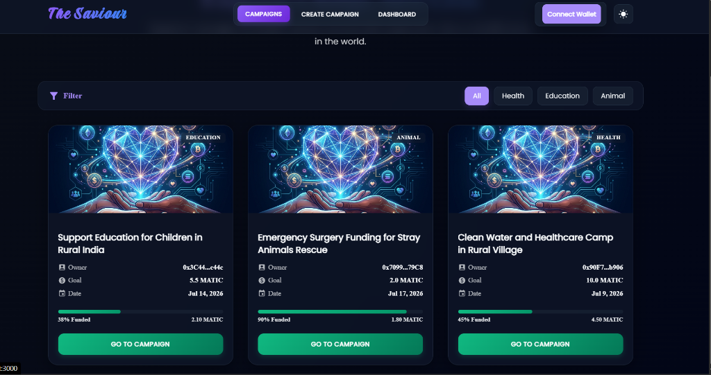
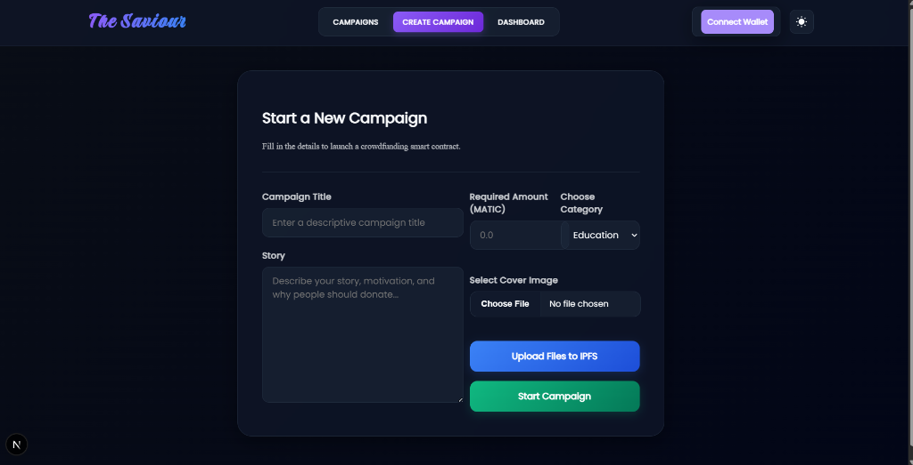

# 🌟 The Saviour - Decentralized Crowdfunding DApp

**The Saviour** is a premium, high-performance decentralized crowdfunding application (DApp) built on the Polygon blockchain. It allows users to launch fundraising campaigns directly on-chain, support global causes securely with cryptocurrency, and track campaign milestones transparently in real-time.

---

## 🎨 Preview & Aesthetics

The application features a modern **glassmorphic design system** with a built-in theme toggle (premium Dark/Light modes), smooth hover micro-animations, and dynamic progress indicators.

### 🏠 Home Page


### ✍️ Start Campaign Page


*   **Campaigns Grid**: Visual cards with category filtering (Health, Education, Animal) and live percentage funded bars.
*   **Decentralized Details Page**: Shows the campaign story from IPFS, goals, contribution details, and lists of contributors.
*   **Smooth Integration**: Easy connection for Web3 wallets with automatic network verification.

---

## 🚀 Key Features

*   **Web3 Integration**: Seamless Metamask integration supporting local Hardhat nodes and the Polygon Amoy Testnet.
*   **Decentralized Storage**: Integrates with IPFS (Infura client) to host campaign stories and cover images, with built-in sandbox mock fallbacks.
*   **Robust Off-Grid Mode**: Configured Next.js image loading logic (`unoptimized: true`) to bypass server-side DNS resolution checks, allowing the client to load IPFS assets directly.
*   **SSR Safe hydration**: Solved React date formatting timezone issues between server and client.
*   **Solidity Smart Contracts**: Deploys a robust `CampaignFactory` which handles the deployment of independent `Campaign` child contracts.

---

## 🛠️ Technology Stack

*   **Frontend Framework**: [Next.js 15](https://nextjs.org/) (Page Router)
*   **Styling & Themes**: [Styled-Components 6](https://styled-components.com/) (Server-Side Style Sheet Registry)
*   **DApp Layer**: [Ethers.js v5](https://docs.ethers.org/v5/)
*   **Smart Contract Development**: [Solidity](https://soliditylang.org/) & [Hardhat](https://hardhat.org/)
*   **Asset Storage**: [IPFS (InterPlanetary File System)](https://ipfs.tech/)
*   **UI Components & Icons**: [Material UI (MUI)](https://mui.com/)

---

## ⚙️ Project Structure

```text
thesaviour/
├── artifacts/             # Compiled Smart Contract ABI JSONs
├── components/            # React UI components
│   ├── Form/             # Campaign creation forms & IPFS upload wrapper
│   └── layout/           # Shared Header, Wallet connection, and Style Themes
├── contracts/             # Solidity Smart Contracts (Campaign.sol)
├── pages/                 # Next.js page routes (Home, Dashboard, Campaign Detail)
├── public/                # Static public assets (images, fallback icons)
├── scripts/               # Smart contract deployment scripts
└── style/                 # Global styling config
```

---

## 💻 Setup & Installation

### 1. Prerequisites
Ensure you have the following installed on your machine:
*   [Node.js](https://nodejs.org/) (v18.x or v20.x recommended)
*   [MetaMask Extension](https://metamask.io/) in your browser

### 2. Installation
Clone the repository and install the project dependencies:
```bash
git clone https://github.com/957908/TheSaviour.git
cd TheSaviour
npm install --legacy-peer-deps
```

### 3. Environment Setup
Create a file named `.env.local` in the root of the project:
```env
NEXT_PUBLIC_RPC_URL=https://rpc-amoy.polygon.technology/
NEXT_PUBLIC_PRIVATE_KEY=your_metamask_private_key
NEXT_PUBLIC_ADDRESS=your_deployed_factory_contract_address

# Optional IPFS Credentials
NEXT_PUBLIC_IPFS_ID=your_infura_project_id
NEXT_PUBLIC_IPFS_KEY=your_infura_project_secret
```
> **Security Note**: Never commit your `.env.local` file containing private keys to public Git repositories.

---

## 🛠️ Smart Contract Compilation & Deployment

You can compile and deploy the smart contracts using Hardhat:

### Compile Contracts
```bash
npx hardhat compile
```

### Deploy to Network
Run the deploy script to put your `CampaignFactory` on the blockchain:
```bash
# Deploys to Local Hardhat Network (default)
npx hardhat run scripts/deploy.js

# Deploys to Polygon Amoy Testnet
npx hardhat run scripts/deploy.js --network polygon
```

---

## 🏃‍♂️ Running the DApp

Start the local development server:
```bash
npm run dev
```

Open your browser and navigate to **[http://localhost:3000](http://localhost:3000)** (or the port specified in your console).

To compile the production build:
```bash
npm run build
npm start
```
